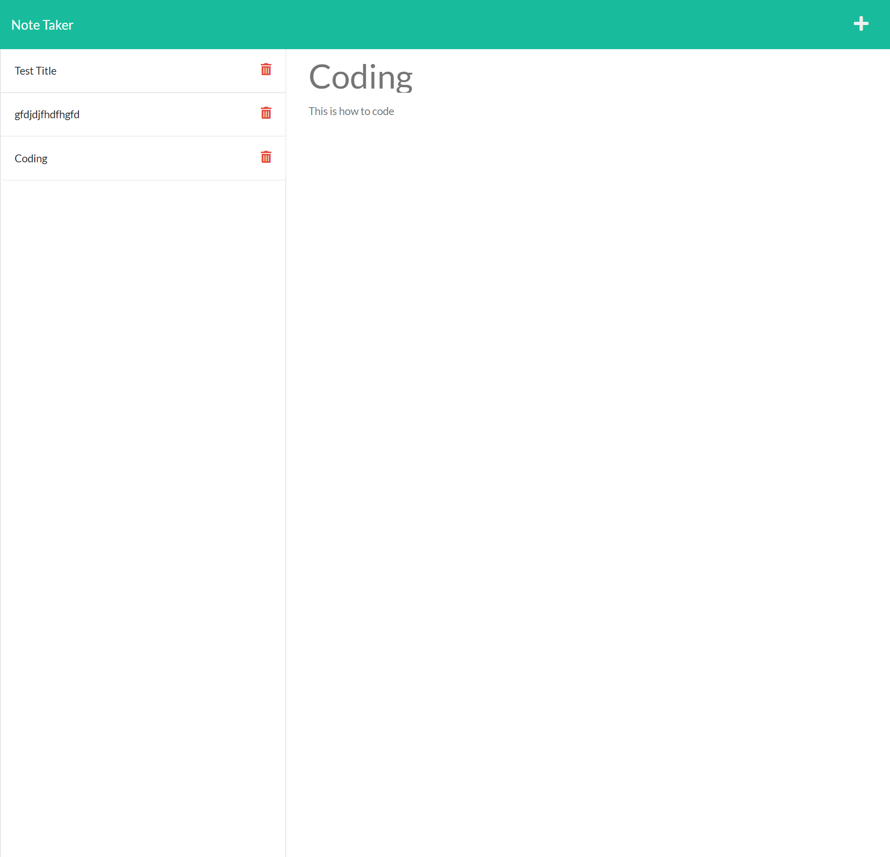

# HW 11 Note Taker App

 ## Description
  This is a note taker that lets you write notes and save them to a server so that you can come back later and view them.

 ## Table of Contents
  - [Insallation](#installation)
  - [Usage](#usage)
  - [Credits](#credits)
  - [License](#license)

 ## Installation
  You must first open the package.json in your terminal and then run npm -i. once you install the packages run npm i express to install express server. after that open the server.js file into your terminal and run node server.js and it will show you are connected to a local host. once the server is up and running hold ctrl and click on the server link address and it will take you to the note taker.

 ## Usage
  You can use this project to create and save notes to help you out. These can be as simple as a grocery list or as important as notes to remind you about what tasks you want to complete during a project.

 ## Credits
  [BradMW](https://github.com/BradMW)

 ## License
  

 ## Features
  This project has the ability to make a note with a title and a body that you can type into as well as a save button. After you have saved a note you can see it append to the left side of the page. once the note shows up there you can click on the note again to view your old notes.

  Link to Heroku where the app is deployed: https://dashboard.heroku.com/apps/hw11-note-taker-bo

